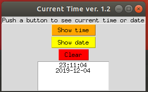
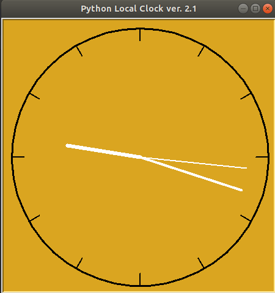

# PythonLocalClock
A simple local clock project written in python for practice

Version 1 (current version 1.2) - datetime module and tkinter

Old version 1 (1.1)

Version 2 (current version 2.1) - turtle module

Old version 2 (2.0)

